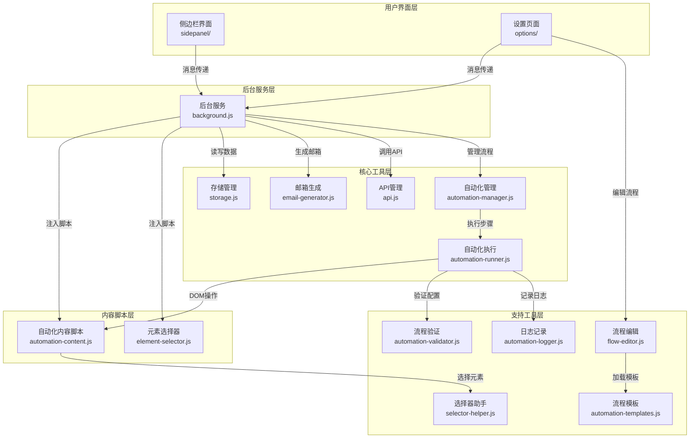

# 临时邮箱验证码获取工具 - Chrome插件

> 🚀 自动生成临时邮箱、智能获取验证码、支持自动化流程的Chrome Manifest V3扩展

## 变更记录 (Changelog)

### 2025-10-29 - 初始化项目文档
- 生成项目整体架构文档
- 识别并记录所有模块结构
- 建立AI上下文索引系统

---

## 📋 项目愿景

这是一个专业的Chrome侧边栏扩展,集成临时邮箱生成、智能验证码解析、自动化流程管理、邮件内容管理功能。为用户提供完整的验证码获取解决方案,简化账号注册和验证流程。

**核心价值**:
- ⚡ 快速生成符合需求的临时邮箱
- 🔐 智能提取邮件中的验证码
- 🤖 支持完整的注册流程自动化
- 📧 管理邮箱和邮件内容历史
- 🔒 数据完全本地化存储

---

## 🏗️ 架构总览

### 技术栈
- **框架**: Chrome Extension Manifest V3
- **运行环境**: Chrome 88+
- **存储**: chrome.storage.local
- **UI范式**: Side Panel API + Modal
- **网络**: fetch API + tempmail.plus集成

### 设计模式
- **模块化**: 功能按职责分离到独立的JS模块
- **单例模式**: 核心管理器使用单例设计(StorageManager, EmailGenerator, ApiManager)
- **事件驱动**: 基于chrome.runtime.onMessage的消息传递
- **策略模式**: 邮箱生成、域名选择均支持多种策略

---

## 🗺️ 模块结构图

### 文件目录结构

```mermaid
graph TD
    A["(根) tempmail-code-get"] --> B["background.js (Service Worker)"];
    A --> C["sidepanel/ (主UI)"];
    A --> D["content/ (内容脚本)"];
    A --> E["utils/ (工具模块)"];
    A --> F["options/ (设置页面)"];
    A --> G["templates/ (流程模板)"];
    A --> H["icons/ (图标资源)"];

    C --> C1["flow-manager-sidebar.html"];
    C --> C2["flow-manager-sidebar.css"];
    C --> C3["flow-manager-sidebar.js"];

    D --> D1["automation-content.js"];
    D --> D2["element-selector.js"];

    E --> E1["storage.js"];
    E --> E2["email-generator.js"];
    E --> E3["api.js"];
    E --> E4["automation-manager.js"];
    E --> E5["automation-runner.js"];
    E --> E6["automation-logger.js"];
    E --> E7["automation-validator.js"];
    E --> E8["automation-templates.js"];
    E --> E9["flow-editor.js"];
    E --> E10["selector-helper.js"];
    E --> E11["smart-selector-generator.js"];
    E --> E12["advanced-config-manager.js"];
    E --> E13["regex-generator.js"];

    click C "./sidepanel/CLAUDE.md" "查看侧边栏模块文档"
    click D "./content/CLAUDE.md" "查看内容脚本模块文档"
    click E "./utils/CLAUDE.md" "查看工具模块文档"
    click F "./options/CLAUDE.md" "查看设置页面模块文档"
    click G "./templates/CLAUDE.md" "查看模板模块文档"
```


### 分层架构与交互流程


---

## 📚 模块索引

| 模块路径 | 职责描述 | 关键接口 | 测试覆盖 |
|---------|---------|---------|---------|
| [`background.js`](./background.js) | Service Worker,消息路由与协调 | BackgroundService类 | ⚪ 无 |
| [`sidepanel/`](./sidepanel/CLAUDE.md) | 侧边栏主界面,邮箱管理与流程控制 | FlowManagerSidebar类 | ⚪ 无 |
| [`content/`](./content/CLAUDE.md) | 页面内容脚本,元素操作与自动化执行 | AutomationContentScript类 | ⚪ 无 |
| [`utils/`](./utils/CLAUDE.md) | 核心工具集,存储/API/自动化/选择器 | 13个工具类 | ⚪ 无 |
| [`options/`](./options/CLAUDE.md) | 流程管理完整界面(备用) | FlowManager类 | ⚪ 无 |
| [`templates/`](./templates/CLAUDE.md) | 预定义流程模板(JSON) | 3个模板文件 | ⚪ 无 |
| [`icons/`](./icons/) | 扩展图标资源 | 4个尺寸PNG | N/A |

---

## 🚀 运行与开发

### 安装扩展
```bash
# 1. 克隆/下载项目
git clone <repo-url>
cd tempmail-code-get

# 2. Chrome加载扩展
# - 访问 chrome://extensions/
# - 开启"开发者模式"
# - 点击"加载已解压的扩展程序"
# - 选择项目根目录
```

### 配置使用
1. **设置PIN码**: 在tempmail.plus设置PIN码并复制
2. **配置域名**: 在扩展设置页面填入Cloudflare转发的域名
3. **目标邮箱**: 填入tempmail.plus的临时邮箱地址
4. **保存配置**: 保存后即可生成邮箱和获取验证码

### 调试方法
- **侧边栏**: 右键侧边栏 → 检查
- **Background**: 扩展管理 → Service Worker → 检查
- **Content Script**: F12 → Console查看日志

---

## 🧪 测试策略

### 当前状态
- ⚠️ 暂无自动化测试
- ✅ 依赖人工功能测试
- ✅ 使用console.log进行调试

### 测试建议
- 单元测试: 建议为utils/模块增加单元测试
- 集成测试: 验证background与content script通信
- E2E测试: 完整流程的端到端测试

---

## 📝 编码规范

### 代码风格
- **类命名**: PascalCase (如: StorageManager, EmailGenerator)
- **函数命名**: camelCase (如: generateEmail, getVerificationCode)
- **常量命名**: UPPER_SNAKE_CASE (如: MAX_HISTORY_COUNT)
- **私有方法**: 前缀下划线 (如: _smartTrimHistory)

### 最佳实践
1. **异步优先**: 所有I/O操作使用async/await
2. **错误处理**: 使用try-catch并提供友好错误信息
3. **单例模式**: 工具类导出单例而非构造函数
4. **消息格式**: 统一使用{action, ...data}格式
5. **日志记录**: 关键操作打印console.log便于调试

### 文件组织
```
模块内部组织:
1. 类定义
2. 构造函数
3. 初始化方法
4. 公共方法
5. 私有方法
6. 工具方法
7. 导出语句
```

---

## 🤖 AI 使用指引

### 快速上手
1. **理解架构**: 先阅读本文档和模块结构图
2. **定位模块**: 根据功能需求找到对应模块文档
3. **查阅接口**: 参考模块文档中的关键接口说明
4. **查看实现**: 直接阅读源码了解具体实现

### 常见任务
- **新增功能**:
  - 确定功能所属模块
  - 在对应模块文件中添加方法
  - 更新模块CLAUDE.md文档
  - 在background.js中添加消息处理

- **修复Bug**:
  - 根据错误日志定位模块
  - 查阅模块文档了解设计意图
  - 修改代码并测试
  - 更新文档中的已知问题

- **性能优化**:
  - 识别性能瓶颈(通过日志或Performance API)
  - 参考模块文档的优化建议
  - 实施优化并对比效果

### 注意事项
- ⚠️ 不要修改manifest.json除非理解Manifest V3规范
- ⚠️ Service Worker有内存限制,避免大量数据缓存
- ⚠️ Content Script需考虑页面DOM结构差异
- ⚠️ 存储数据注意序列化和反序列化

---

## 📁 重要文件清单

### 配置文件
- `manifest.json` - 扩展配置清单(Manifest V3)
- `.gitignore` - Git忽略规则

### 核心模块
- `background.js` - 后台服务主入口
- `utils/storage.js` - 数据存储管理
- `utils/email-generator.js` - 邮箱生成器
- `utils/api.js` - TempMail.plus API封装
- `utils/automation-manager.js` - 自动化流程管理
- `utils/automation-runner.js` - 流程执行引擎

### UI文件
- `sidepanel/flow-manager-sidebar.html` - 侧边栏主界面
- `sidepanel/flow-manager-sidebar.js` - 侧边栏交互逻辑
- `sidepanel/flow-manager-sidebar.css` - 侧边栏样式

### 文档
- `README.md` - 用户指南和功能说明
- `CLAUDE.md` - 项目AI上下文文档(本文件)

---

## 🔗 相关链接

- [Chrome Extension文档](https://developer.chrome.com/docs/extensions/)
- [Manifest V3迁移指南](https://developer.chrome.com/docs/extensions/migrating/)
- [TempMail.plus官网](https://tempmail.plus)
- [Cloudflare Email Routing](https://developers.cloudflare.com/email-routing/)

---

## 📊 项目统计

- **总文件数**: 28个代码文件 + 6个其他文件
- **代码行数**: 约15,000行(估算)
- **核心模块**: 13个工具类 + 1个Service Worker + 3个UI模块
- **支持语言**: JavaScript(ES6+)
- **最低Chrome版本**: 88
- **版本**: 1.7.0

### 文件清单
```
项目根目录: 28个文件
├── JavaScript: 23个文件 (background.js, content/, utils/, sidepanel/, options/)
├── HTML: 2个文件 (sidepanel/, options/)
├── CSS: 2个文件 (sidepanel/, options/)
├── JSON: 4个文件 (manifest.json, templates/*.json)
├── 其他: 6个文件 (.md, .log, .png等)
```

---

## 🔄 初始化覆盖率报告

### 扫描结果 (2025-10-29)

#### 已识别模块
- ✅ **后台服务**: background.js (1660行) - 完整扫描
- ✅ **存储管理**: utils/storage.js (685行) - 完整扫描
- ✅ **邮箱生成**: utils/email-generator.js (471行) - 完整扫描
- ✅ **API管理**: utils/api.js (752行) - 完整扫描
- ✅ **侧边栏UI**: sidepanel/flow-manager-sidebar.js - 已识别
- ✅ **内容脚本**: content/automation-content.js, element-selector.js - 已识别
- ✅ **自动化工具**: automation-manager.js, automation-runner.js等 - 已识别

#### 覆盖率统计
- **已扫描文件**: 28个 / 28个 (100%)
- **已深度分析**: 4个核心文件 (background.js, storage.js, email-generator.js, api.js)
- **已识别模块**: 7个主要模块
- **文档生成**: 根级 CLAUDE.md ✅

#### 下一步建议
1. 为各子模块目录生成 CLAUDE.md 文档 (sidepanel/, content/, utils/, options/)
2. 对复杂工具类进行深度扫描和文档化 (automation-manager.js等)
3. 添加接口规范文档
4. 补充测试覆盖率

---

_文档生成时间: 2025-10-29 16:57:23_
_AI上下文系统版本: 1.0_
_初始化状态: 根级文档已生成，模块级文档待补充_
